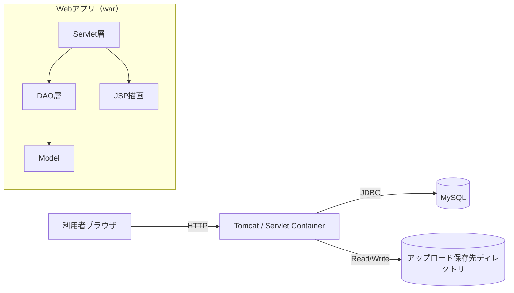
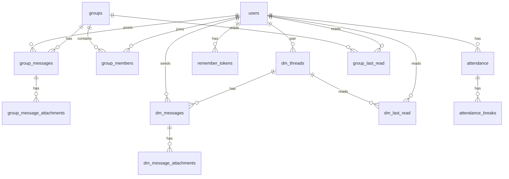
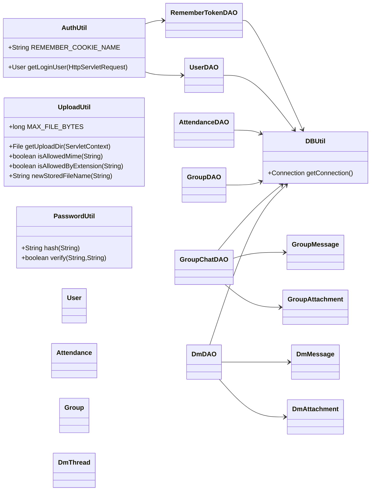
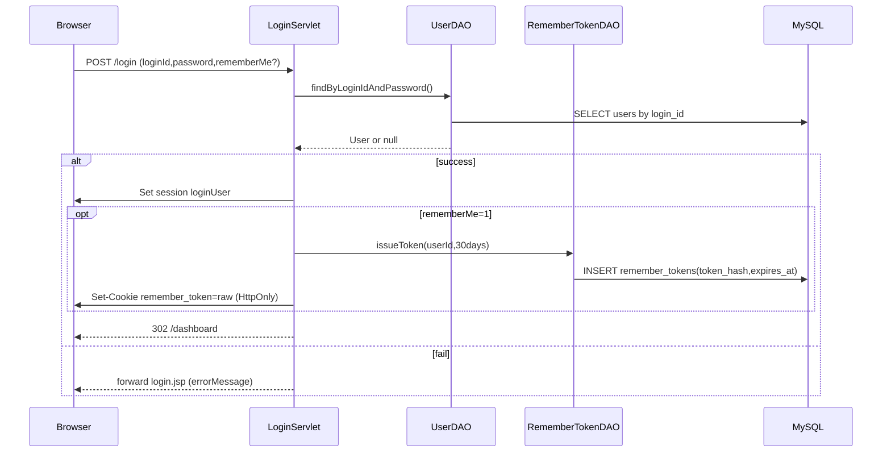

## 社内向け：勤怠管理サイト（TimeCard Web School）開発・運用 引き継ぎ資料

この資料は **「これさえあれば、作成者が不在でも開発・運用の引き継ぎができる」** ことを目的に、内部構造・データフロー・DB・URL/API・運用手順をまとめたものです。  
（対象：開発者 / インフラ・運用担当 / 保守担当）

---

## 0. 重要な前提（最初に読む）

- **アプリ形態**：Java（Servlet/JSP）+ MySQL、`war` として Tomcat にデプロイ
- **認証**：セッション `loginUser` を基本に、任意で **remember-me（cookie + DB）** を併用
- **データ削除方針**：
  - ユーザー：`users.is_deleted=1` の **論理削除（退会）**
  - グループ：`groups.is_deleted=1` の **論理削除**
  - 添付：DBはメタ情報、実ファイルはサーバ保存（削除・運用設計が必要）

---

## 1. 技術スタック / 依存関係

- **Java**：21
- **Web**：Jakarta Servlet 6 / JSP 3.1 / JSTL 3.0
- **DB**：MySQL 8
- **ビルド**：Maven（`packaging=war`）
- **暗号**：
  - パスワード：bcrypt（`at.favre.lib:bcrypt`）
  - remember-me：SHA-256（DBにハッシュ保存）

依存は `pom.xml` を参照。

---

## 2. リポジトリ構成（重要ディレクトリ）

- **`src/servlet/`**：画面/APIの入口（Controller）
- **`src/dao/`**：DBアクセス（SQL）
- **`src/model/`**：DTO/Model
- **`src/util/`**：共通（認証、DB接続、アップロード、パスワード）
- **`src/resources/`**：DB設定、SQLスキーマ
- **`WebContent/WEB-INF/jsp/`**：JSP（画面）
- **`WebContent/css` / `WebContent/js`**：フロント静的ファイル

---

## 3. システム全体像（コンポーネント）

### 3-1. 高レベル構成



### 3-2. 主要な設計判断（運用に効く）
- **通知の仕組み**：`/api/notifications` が **既読テーブル（last_read）** を使って新着判定し、返却した分は **既読を進めて重複通知を抑制**。
- **チャットのリアルタイム**：WebSocketではなく **ポーリング（2秒）**。
- **添付の保存**：DBはメタ情報のみ。実体は `UploadUtil.getUploadDir()` の戻り先に保存。

---

## 4. 認証・セッション・remember-me

### 4-1. セッションキー
- **`HttpSession` の `loginUser`** に `model.User` を格納（ログイン成功時、または remember-me 成功時）

### 4-2. remember-me（ログイン状態を保持する）
- cookie 名：`remember_token`（`AuthUtil.REMEMBER_COOKIE_NAME`）
- ログイン時にチェックされると：
  - `RememberTokenDAO.issueToken(userId, 30)` で **30日** のトークン発行
  - cookie に **生トークン** を入れる（DBには **SHA-256ハッシュ** を保存）
- `AuthUtil.getLoginUser()` がセッション未設定時に cookie を見て自動ログインを試行
- ログアウト時に cookie を削除し、DBトークンも `revokeToken` で削除

### 4-3. 運用メモ（セキュリティ/保守）
- DBの `remember_tokens` は期限切れが残るので、運用で定期削除推奨：

```sql
DELETE FROM remember_tokens WHERE expires_at < NOW();
```

---

## 5. DB設計（ER・テーブル概要）

### 5-1. ER（概念）



### 5-2. スキーマの一次情報
- **一次情報**：`src/resources/create_tables.sql`  
  ここが仕様の正です（コードよりもまずSQLを信じる）。

### 5-3. テーブル別ポイント（運用/改修に効く）

- **`users`**
  - `password_hash`：bcrypt（旧データ互換で平文もあり得るが、ログイン成功時に自動bcrypt移行）
  - `secret_question` / `secret_answer_hash`：パスワード再設定用（答えもbcrypt）
  - `dm_allowed`：ID検索DMを受け取る許可（1=許可）
  - `icon_filename`：アイコン実体ファイル名（保存先は UploadUtil）
  - `is_deleted`：退会の論理削除

- **`groups` / `group_members`**
  - `groups.is_deleted`：グループ削除は論理削除
  - `GroupDAO.createGroup` は作成者を `group_members` に自動追加

- **`attendance`**
  - `group_id`：グループ別勤怠。グループなしは `NULL`
  - `group_id_key`：`NULL` を `0` 相当で扱うための生成列（ユニーク制約用）
  - `is_corrected` / `corrected_by_admin`：修正済みと修正種別
  - `prev_start_time` / `prev_end_time`：修正前の値退避
  - `is_cancelled` / `cancelled_by_admin`：取消と取消種別（取消は時刻をNULLに戻す）

- **`attendance_breaks`**
  - 1勤怠に対して複数休憩（`break_end IS NULL` が “休憩中”）

- **チャット（グループ/DM）**
  - 実体ファイル：サーバ保存
  - メタ：`*_attachments` テーブル
  - 既読：`group_last_read` / `dm_last_read`

---

## 6. URL / Servlet / 役割一覧（入口一覧）

### 6-1. 画面（JSPを返す）
- **`/`**：`WebContent/index.jsp`（ログイン済みなら `/dashboard` へ）
- **`/login`**：`LoginServlet` → `login.jsp`
- **`/logout`**：`LogoutServlet`（セッション破棄 + remember-me失効）
- **`/register`**：`RegisterServlet` → `register.jsp`
- **`/forgot-password`**：`ForgotPasswordServlet` → `forgot_password.jsp`
- **`/dashboard`**：`DashboardServlet` → `dashboard.jsp`
- **`/attendance`**：`AttendanceServlet` → `attendance.jsp`
- **`/attendance/list`**：`AttendanceListServlet` → `attendance_list.jsp`
- **`/groups`**：`GroupsServlet` → `groups.jsp`
- **`/group/create`**：`GroupCreateServlet` → `group_create.jsp`
- **`/group/manage`**：`GroupManageServlet` → `group_manage.jsp`
- **`/group/info`**：`GroupInfoServlet` → `group_info.jsp`
- **`/group/attendance`**：`GroupAttendanceServlet` → `group_attendance.jsp`
- **`/group/chat`**：`GroupChatServlet` → `group_chat.jsp`
- **`/dm`**：`DmServlet` → `dm.jsp`
- **`/dm/chat`**：`DmChatServlet` → `dm_chat.jsp`
- **`/profile`**：`ProfileServlet` → `profile.jsp`
- **`/privacy`**：`PrivacyServlet` → `privacy.jsp`

### 6-2. 更新系（POSTで状態変更）
- **`/attendance/correct`**：`AttendanceCorrectServlet`（本人or管理者の修正）
- **`/attendance/cancel`**：`AttendanceCancelServlet`（本人or管理者の取消）
- **`/group/delete`**：`GroupDeleteServlet`（管理者のみ）
- **`/user/delete`**：`UserDeleteServlet`（退会：ユーザー論理削除 + 管理グループも論理削除）

### 6-3. API（JSON）
- **`/api/notifications`**：`NotificationsApiServlet`（通知）
- **`/api/group/chat/messages`**：`GroupChatMessagesApiServlet`（グループチャット新着）
- **`/api/dm/chat/messages`**：`DmChatMessagesApiServlet`（DM新着）
- **`/api/group/members`**：`GroupMembersApiServlet`（DM開始用のメンバー一覧）
- **`/api/users/suggest`**：`UserSuggestServlet`（グループ管理のメンバー追加補助：管理者のみ）
- **`/api/users/dm_suggest`**：`DmUserSuggestServlet`（DMのID検索：`dm_allowed=1` のみ）
- **`/api/user/profile`**：`UserProfileApiServlet`（プロフィール表示モーダル用）

### 6-4. ファイル配信（添付/アイコン）
- **`/group/chat/file?id=...`**：`GroupChatFileServlet`（権限：グループメンバー/管理者）
- **`/dm/chat/file?id=...`**：`DmFileServlet`（権限：スレッド参加者）
- **`/user/avatar?id=...`**：`UserAvatarServlet`（※ログイン必須。未設定時は `/img/icon.png` へ）

---

## 7. クラス図（責務の見取り図）

### 7-1. レイヤ構造



---

## 8. 主要機能のデータフロー（改修/障害対応のための“道筋”）

### 8-1. ログイン（remember-me含む）



### 8-2. 自動ログイン（AuthUtil）
- 画面/APIの多くは最初に `AuthUtil.getLoginUser()` を呼びます。
- セッションに `loginUser` が無い場合：
  - cookie `remember_token` → `remember_tokens` で user_id を検索（期限内のみ）
  - `UserDAO.findById()` で `loginUser` を再構築しセッションに保存

### 8-3. 勤怠（出勤/休憩/退勤）

#### GET `/attendance`
- グループ一覧取得（`GroupDAO.findGroupsByUser`）
- 選択 `groupId` の権限チェック（管理者orメンバーのみ有効）
- 今日の `attendance` を `(user_id, work_date, group_id)` で取得
- 休憩中なら open break の開始時刻からリアルタイム合算表示

#### POST `/attendance` action別
- **start**
  - 当日レコードが無ければ INSERT
  - 取消済みなら取消フラグ解除後、start_time を更新
- **break**
  - 出勤済み＆退勤前のみ
  - `break_end IS NULL` の有無で開始/終了をトグル
- **end**
  - end_time を更新

### 8-4. 勤怠修正（本人 or 管理者）
- `AttendanceCorrectServlet`
  - 本人：自分の勤怠は修正可能（グループなしもOK）
  - 他人：**グループ管理者のみ**（かつ対象がそのグループのメンバー）
  - 既存が無い日：`insertAsCorrection` で新規作成（修正扱い）
  - 既存がある日：`updateAsCorrection`（`prev_*` 退避→上書き、フラグ/修正者記録）

### 8-5. 勤怠取消（本人 or 管理者）
- `AttendanceCancelServlet`
  - 他人の取消は **グループ管理者のみ**（グループなしは対象外）
  - 取消処理は `start_time/end_time=NULL` に戻し `is_cancelled=1` を立てる

### 8-6. グループチャット（既読と通知の関係が重要）
- `GroupChatServlet#doGet`：チャット表示時に `group_last_read` を NOW に更新（“見たら既読”）
- `GroupChatMessagesApiServlet`：ポーリング時にも `group_last_read` を NOW に更新（“見てる間は既読が進む”）
- `NotificationsApiServlet`：`group_last_read.last_read_at` より新しい投稿を通知として返す

### 8-7. DM（既読と通知）
- `DmChatServlet#doGet`：表示時 `dm_last_read` を NOW に更新
- `DmChatMessagesApiServlet`：ポーリングでも `dm_last_read` を NOW に更新
- `NotificationsApiServlet`：`dm_last_read.last_read_at` より新しい投稿を通知として返す
- `DmDAO.findOrCreateThread` はスレッド作成後に `dm_last_read` を両者分 `INSERT IGNORE` する（初回大量通知防止）

---

## 9. 添付ファイル/アイコン（保存先・上限・運用）

### 9-1. 保存先決定ロジック（UploadUtil）
優先順位（コード通り）：
- システムプロパティ `-Dtimecard.upload.dir=...`
- 環境変数 `TIMECARD_UPLOAD_DIR=...`
- `catalina.base/timecard_uploads`（Tomcatがある場合）
- `webapp/uploads` 実体パス
- `java.io.tmpdir/timecard_uploads`

### 9-2. 上限
- チャット添付：**1ファイル50MB**、リクエスト全体は 50MB×6（`@MultipartConfig`）
- プロフィールアイコン：**5MB**（トリミングPNG dataURL優先）

### 9-3. 運用で決めるべきこと（必須）
- **バックアップ/保全**：DBバックアップとは別に、アップロードディレクトリのバックアップ方針が必要
- **削除方針**：DBレコードと実ファイルの整合（孤児ファイル/孤児レコード）
- **容量監視**：ディスク逼迫を監視（特に動画/音声/zip）

---

## 10. 通知仕様（運用・障害対応のための詳細）

### 10-1. 通知の生成条件
- グループ：
  - `group_members` に所属
  - 投稿者が自分以外
  - `group_messages.created_at > group_last_read.last_read_at`
- DM：
  - スレッド参加者
  - 投稿者が自分以外
  - `dm_messages.created_at > dm_last_read.last_read_at`

### 10-2. 重複通知の抑制
- `/api/notifications` は返却した通知分の `created_at` を集計し、
  - `group_last_read` / `dm_last_read` を `GREATEST` で進める
- 結果：通知を「見たこと」にして、同じ通知を出し続けない設計

---

## 11. 運用手順（サーバー担当向け）

### 11-1. 初回構築（最短）
1. MySQL にスキーマ投入（`src/resources/create_tables.sql`）
2. `src/resources/database.properties` を環境に合わせて設定
3. `mvn clean package` で `target/timecard-web-school.war` を作る
4. Tomcat の `webapps/` に配置して起動

### 11-2. 重要な運用設定
- **アップロード永続化**：本番は必ず `TIMECARD_UPLOAD_DIR` か `-Dtimecard.upload.dir` で保存先固定
- **DBバックアップ**：最低でも日次
- **remember_tokens 清掃**：期限切れを定期削除（SQLは 4-3 参照）

### 11-3. ログの見方（最低限）
- 例外は `e.printStackTrace()` または `log()` で出るため、Tomcat標準ログ（catalina.out 等）を参照
- 通知・アップロード失敗は `GroupChatServlet/DmChatServlet` が `log(...)` する箇所あり

---

## 12. 障害対応（Runbook）

### 12-1. 代表的な症状→見る場所
- **ログインできない**
  - `users.is_deleted=1` になっていないか
  - パスワードのハッシュ形式（旧平文互換あり）
- **通知が出ない / 出続ける**
  - `group_last_read` / `dm_last_read` の `last_read_at` 更新が止まっていないか
  - DBの時刻ズレ（アプリとDBのタイムゾーン）
- **添付が開けない（404）**
  - `*_attachments.stored_filename` のファイルが保存先ディレクトリにあるか
  - `UploadUtil.getUploadDir()` が指している場所が環境で変わっていないか
- **勤怠が二重に入る/入らない**
  - `attendance.uk_user_date_group (user_id,work_date,group_id_key)` の制約
  - `groupId` の扱い（NULL と 0 を混同していないか）

---

## 13. 開発ガイド（改修の手順を固定化）

### 13-1. 画面追加の定石
- `src/servlet/` に `@WebServlet("/path")` を追加
- `doGet` で `AuthUtil.getLoginUser()` によるログインチェック
- `dao` に必要なSQL追加（可能な限り `PreparedStatement`）
- `WebContent/WEB-INF/jsp/` にJSP追加

### 13-2. 権限チェックの定石
- グループ系：`GroupDAO.isGroupAdmin/isGroupMember`
- DM系：`DmDAO.isUserInThread`
- 添付DL：上記の権限が通ること

### 13-3. 変更時の“最低チェック”
- 既読（last_read）更新が意図通りか（通知への影響が大きい）
- 添付の保存先が環境で変わらないか（`UploadUtil`）
- `is_deleted` を無視するSQLになっていないか（ユーザー/グループ）

---

## 14. 引き継ぎチェックリスト（そのまま使える版）

- **環境**
  - [ ] `database.properties` の値が環境に合っている
  - [ ] `TIMECARD_UPLOAD_DIR` または `timecard.upload.dir` を本番で設定している
- **DB**
  - [ ] `create_tables.sql` 適用済み
  - [ ] バックアップ手順と復旧手順がある
  - [ ] remember_tokens の期限切れ削除ジョブがある
- **運用**
  - [ ] Tomcatログの場所/閲覧権限が共有されている
  - [ ] ディスク容量監視（特にアップロード領域）がある
- **保守**
  - [ ] 主要URL/API一覧（6章）が共有されている
  - [ ] 既読/通知の仕様（10章）が共有されている


